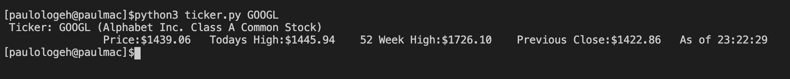

# NASDAQ 100 Ticker CLI
Command line tool to quickly get information about stocks in the NASDAQ100
## Requirements
- Python3
- python-pip
- git

## Setup and Installation
```
git clone https://github.com/paulologeh/NASDAQ100.git
cd NASDAQ100
pip3 install -r requirements.txt 
```

## Usage
```
python3 ticker.py                            shows usage manual
python3 ticker.py [info]                     shows usage manual
python3 ticker.py [list]                     lists all stocks in the NASDAQ100
python3 ticker.py [list] [sort]              lists all stocks in the NASDAQ100 sorted by name
python3 ticker.py [list] [sort-price]        lists all stocks in the NASDAQ100 sorted by lowest price
python3 ticker.py [search] [term]            returns the stock closest to term from the NASDAQ100 
python3 ticker.py [symbol]                   get's all data about the closest matching stock to symbol
python3 ticker.py [symbol] [price]           gets price of the symbol
python3 ticker.py [symbol] [todays-high]     gets today's high
python3 ticker.py [symbol] [52-week-high]    gets 52 week high
python3 ticker.py [symbol] [previous-close]  gets previous close
python3 ticker.py [highest]                  returns stock with highest price
python3 ticker.py [lowest]                   returns stock with lowest price
python3 ticker.py [winner]                   returns stock with highest percentage gain from the previous close
python3 ticker.py [looser]                   returns stock with lowest percentage gain from the previous close'''
```
Sample Usage
